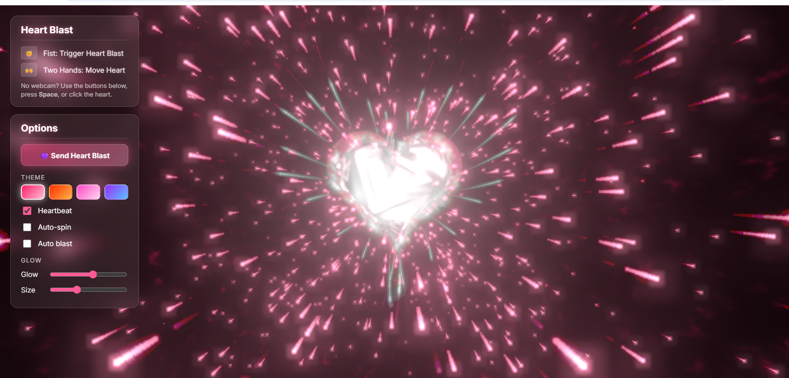

# 💗 Heart Blast

An interactive 3D heart animation powered by **Three.js** and **MediaPipe hand tracking**. Trigger beautiful heart-shaped energy blasts using hand gestures or the on-screen controls.

🔗 **Live Demo:** [zahraaabidha.github.io/heart-blast](https://zahraaabidha.github.io/heart-blast/)



---

## ✨ Features

- **3D Heart Core** — A glowing, living heart rendered with custom GLSL noise shaders
- **Heart-Shaped Blast** — Energy beams fire outward along a heart outline + expanding shockwave rings
- **Hand Gesture Control** via MediaPipe (no backend needed — runs fully in the browser)
  - ✊ **Fist** — Trigger a Heart Blast
  - 🙌 **Two Hands** — Move the heart around the screen
- **4 Themes** — Romance · Passion · Sweetheart · Galaxy Love
- **Options Panel**
  - Send Heart Blast button
  - Heartbeat animation toggle (lub-dub rhythm)
  - Auto-spin toggle
  - Auto blast toggle
  - Glow & Size sliders
- **No webcam? No problem** — press `Space`, click the heart, or use the panel buttons

---

## 🚀 How to Use

### Online
Just open the live link: **[zahraaabidha.github.io/heart-blast](https://zahraaabidha.github.io/heart-blast/)**

### Local
```bash
# Clone the repo
git clone https://github.com/Zahraaabidha/heart-blast.git
cd heart-blast

# Serve it locally (Python 3)
python -m http.server 8123
```
Then open `http://localhost:8123` in your browser.

---

## 🎮 Controls

| Action | How |
|---|---|
| Trigger Heart Blast | ✊ Fist gesture · `Space` key · Click the heart · Button |
| Move the Heart | 🙌 Two hands moving together |
| Change Theme | Click a colour swatch in the Options panel |
| Toggle Heartbeat | Checkbox in Options panel |
| Toggle Auto-spin | Checkbox in Options panel |
| Toggle Auto Blast | Checkbox in Options panel |
| Adjust Glow / Size | Sliders in Options panel |

---

## 🛠️ Built With

- [Three.js](https://threejs.org/) — 3D rendering
- [MediaPipe Hands](https://developers.google.com/mediapipe/solutions/vision/hand_landmarker) — Real-time hand tracking
- [UnrealBloomPass](https://threejs.org/docs/#examples/en/postprocessing/UnrealBloomPass) — Bloom & glow post-processing
- Pure HTML · CSS · JavaScript (no build tools needed)

---

## 📁 Project Structure

```
heart-blast/
└── index.html    # Everything — 3D scene, shaders, hand tracking, UI
```

---

## 👩‍💻 Author

**Aabidha Zahra** — [@Zahraaabidha](https://github.com/Zahraaabidha)
